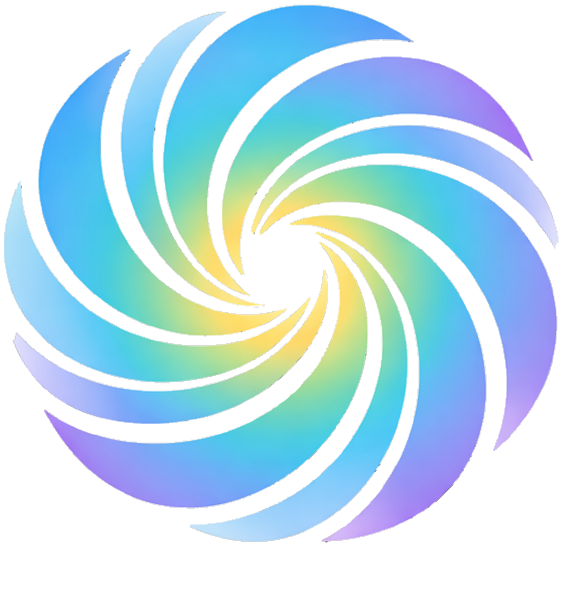
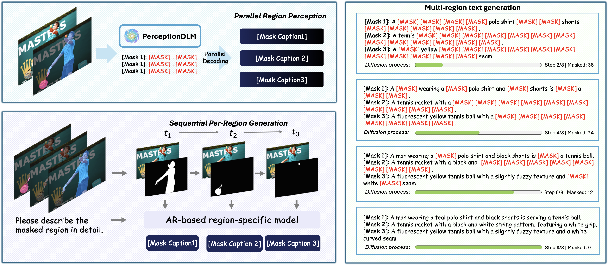
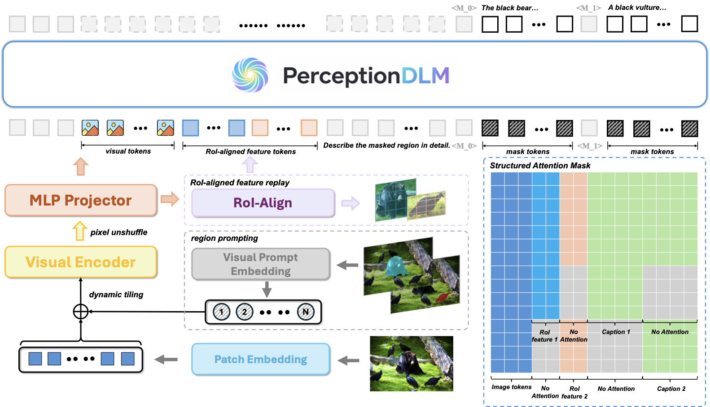
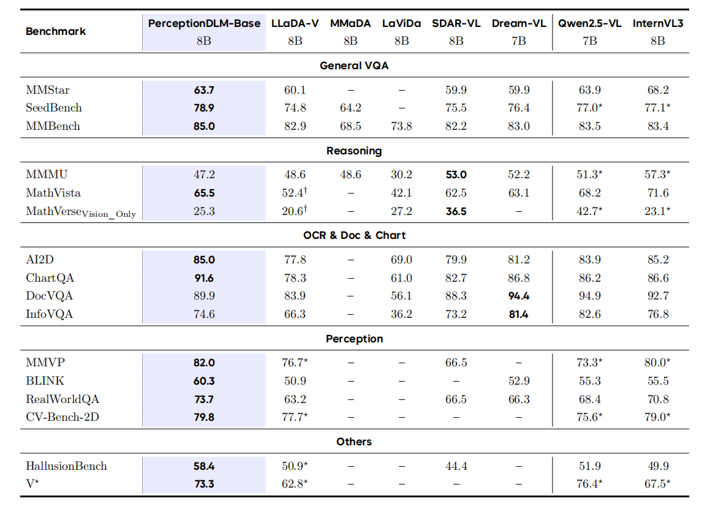

<div align="center">

<h1>
  
  PerceptionDLM
</h1>

### Parallel Region Perception with Multimodal Diffusion Language Models

[](https://arxiv.org/abs/2606.19534)
[](https://msalab-pku.github.io/projects/PerceptionDLM/)
[](https://huggingface.co/collections/MSALab/perceptiondlm-model-zoo)
[](https://huggingface.co/datasets/MSALab/PerceptionDLM-Data)
[](https://huggingface.co/datasets/MSALab/ParaDLC-Bench)
[](https://github.com/MSALab-PKU/PerceptionDLM)
[](LICENSE)

<p>
  <a href="#-highlights">Highlights</a> •
  <a href="#-news">News</a> •
  <a href="#-installation">Installation</a> •
  <a href="#-models--datasets">Models & Datasets</a> •
  <a href="#-quick-start">Quick Start</a> •
  <a href="#-training">Training</a> •
  <a href="#-evaluation">Evaluation</a> •
  <a href="#-citation">Citation</a>
</p>



</div>

## 🎬 Demos

Parallel region captioning in action — given multiple masks, PerceptionDLM describes **all regions simultaneously** in a single denoising pass:

<div align="center">
<table>
<tr>
<td width="50%">

https://github.com/user-attachments/assets/cd078bbc-d24b-4c55-b8ee-4ac86685d831

</td>
<td width="50%">

https://github.com/user-attachments/assets/269b186c-468b-49f4-b25a-88f1be3d8bdf

</td>
</tr>
</table>
</div>

> If the videos do not play inline, click to view: [demo&nbsp;0](assets/demo_0.mp4) · [demo&nbsp;1](assets/demo_1.mp4).

---

**PerceptionDLM** is a multimodal **diffusion** language model optimized for **efficient parallel region perception**. Built upon a strong foundational baseline (**PerceptionDLM-Base**), it fully leverages the parallel decoding nature of diffusion language models (DLMs): given an image and multiple region masks, it generates descriptions for **all regions simultaneously** within a single denoising process — avoiding the linear latency growth of autoregressive (AR) region captioners.

## ✨ Highlights

- 🧩 **Parallel region captioning.** Describe many masked regions in a *single* denoising pass, achieving up to **3.4× throughput speedup** in dense multi-region scenarios.
- 🏆 **Strong diffusion VLM baseline.** PerceptionDLM-Base outperforms LLaDA-V on **15 / 16** multimodal benchmarks, establishing a new state of the art among open discrete diffusion VLMs.
- 📊 **New benchmark — ParaDLC-Bench.** A multi-region localized captioning benchmark that jointly evaluates caption *quality* and inference *efficiency*.
- 🔁 **Fully open.** Code, model weights, training data recipe, and evaluation suite are released.

<div align="center">
  
</div>

## 📰 News

- **[2026-6]** 🎉 PerceptionDLM is released! Paper, code, models, and ParaDLC-Bench are now public.

## 📦 Installation

We use [`uv`](https://github.com/astral-sh/uv) for fast and reproducible Python environment management.

```bash
# 1. Install uv
curl -LsSf https://astral.sh/uv/install.sh | sh

# 2. Clone the repository
git clone https://github.com/MSALab-PKU/PerceptionDLM.git
cd PerceptionDLM

# 3. Sync the environment for the model you want to use
uv sync --extra=dmllm    # for PerceptionDLM-Base
uv sync --extra=pdmllm   # for PerceptionDLM (parallel region perception)
```

After syncing, activate the virtual environment (e.g., `source .venv/bin/activate`).

## 🤗 Models & Datasets

| Type | Name | Link |
| :--- | :--- | :--- |
| Model | **PerceptionDLM-Base** (8B) | [🤗 MSALab/PerceptionDLM-Base](https://huggingface.co/MSALab/PerceptionDLM-Base) |
| Model | **PerceptionDLM** (8B) | [🤗 MSALab/PerceptionDLM](https://huggingface.co/MSALab/PerceptionDLM) |
| Backbone | LLaDA-8B-Instruct (HF format) | [🤗 MSALab/LLaDA-8B-Instruct-HF](https://huggingface.co/MSALab/LLaDA-8B-Instruct-HF) |
| Data | **PerceptionDLM-Data** (training data) | [🤗 MSALab/PerceptionDLM-Data](https://huggingface.co/datasets/MSALab/PerceptionDLM-Data) |
| Benchmark | **ParaDLC-Bench** | [🤗 MSALab/ParaDLC-Bench](https://huggingface.co/datasets/MSALab/ParaDLC-Bench) · [`evaluation/ParaDLC-Bench`](evaluation/ParaDLC-Bench) |

## 🚀 Quick Start

Run direct inference on the provided sample images in [`assets/`](assets).

### PerceptionDLM-Base (image-level understanding)

```bash
python demo/infer_dmllm.py \
  --model-path MSALab/PerceptionDLM-Base \
  --image assets/demo.jpg \
  --prompt "What color shirt is the man in the picture wearing?" \
  --gen-length 64 --block-length 64 --steps 64
```

### PerceptionDLM (parallel region captioning)

Generate captions for one or more binary masks **in parallel**:

```bash
python demo/infer_pdmllm.py \
  --model-path MSALab/PerceptionDLM \
  --image assets/demo.jpg \
  --masks assets/demo_mask_0.jpg \
          assets/demo_mask_1.jpg \
          assets/demo_mask_2.jpg \
  --gen-length 32 --steps 32 --temperature 0.0 --top-p 1.0
```

> 💡 A web demo is also available under [`demo/gradio`](demo/gradio).

## 📚 Data Preparation

Download the datasets from Hugging Face and organize them as shown below:

- [Bee Collections](https://huggingface.co/collections/Open-Bee/bee) — `Bee-Training-Data-Stage1`, `Bee-Training-Data-Stage2`, `Honey-Data-15M`
- [LLaVA-OneVision-1.5-Instruct-Data](https://huggingface.co/datasets/mvp-lab/LLaVA-OneVision-1.5-Instruct-Data)
- [🤗 MSALab/PerceptionDLM-Data](https://huggingface.co/datasets/MSALab/PerceptionDLM-Data) — region mask/caption annotations for PerceptionDLM

```text
./
├── datasets/                              # PerceptionDLM-Base (4-stage) training data
│   ├── Bee-Training-Data-Stage1/
│   ├── Bee-Training-Data-Stage2/
│   ├── LLaVA-OneVision-1.5-Instruct-Data/
│   └── Honey-Data-15M/
├── annotations/                           # region mask/caption annotations (PerceptionDLM)
│   ├── dam_dataset.json
│   ├── coconut_dataset.json
│   └── sam_dataset.json
└── images/                                # corresponding image files
```

> 📄 For detailed dataset formats and config structures, see [datasets.md](datasets.md).

### Model Conversion (optional)

To train from the original LLaDA weights, convert them to our format first (or simply use the pre-converted `MSALab/LLaDA-8B-Instruct-HF` on Hugging Face, which is the default in all configs):

```bash
python scripts/convert.py \
  --model_path /path/to/LLaDA-8B-Instruct \
  --output /path/to/LLaDA-8B-Instruct-HF
```

## 🏋️ Training

Training configurations (data configs and train configs) live in the [`configs/`](configs) directory.

```bash
export WANDB_API_KEY="your_wandb_api_key_here"

# Example: 8 GPUs per node
bash scripts/dmllm_multi_run.sh train <data_config> <training_config> 8
```

<details>
<summary><b>Reproducing our training setup</b></summary>

- **PerceptionDLM-Base:** full 4-stage pipeline on **32× NVIDIA H100 (80GB)** GPUs (~3 weeks total).
- **PerceptionDLM:** initialized from PerceptionDLM-Base and trained on the full ParaCaption corpus in ~**2 days on 32× H100**.

See [datasets.md](datasets.md) and the paper appendix for the exact per-stage hyper-parameters.

</details>

## 📈 Evaluation

We provide a comprehensive evaluation suite covering both **Multimodal Benchmarks** (via VLMEvalKit) and **Dense Grounded Captioning** (ParaDLC-Bench & DLC-Bench). Our **ParaDLC-Bench** is available on Hugging Face: [🤗 MSALab/ParaDLC-Bench](https://huggingface.co/datasets/MSALab/ParaDLC-Bench).

👉 See the dedicated **[Evaluation Guide](evaluation/README.md)** for setup, commands, and judge configuration.

## 📊 Main Results

### PerceptionDLM-Base — General Multimodal Understanding

PerceptionDLM-Base establishes a strong open **diffusion** VLM baseline, outperforming LLaDA-V on **15 / 16** benchmarks and staying competitive with leading AR VLMs at the same scale.

<div align="center">
  
</div>

> **Bold** = best score in each row. "–" = not reported; $^\dagger$ / $^\star$ = re-evaluated by us (official scripts / VLMEvalKit). See the paper for the full protocol.

### PerceptionDLM — Parallel Region Perception

PerceptionDLM achieves a strong accuracy–efficiency trade-off on multi-region captioning:

<div align="center">

| Method | Type | ParaDLC-Bench Avg (%) | TPF ↑ | Time (s) ↓ |
| :--- | :--- | :---: | :---: | :---: |
| GAR-8B | AR (sequential) | 69.5 | 1.0 | 479 |
| LLaDA-V-8B | Diffusion | 35.2 | 1.0 | 3241 |
| **PerceptionDLM-8B** | **Diffusion (parallel)** | **62.4** | **2.9** | **276** |

</div>

> `TPF` = Tokens Per Forward (higher means more parallel). Full tables are reported in the paper.

## 🙏 Acknowledgements

This project builds upon the excellent work of [LLaDA](https://github.com/ML-GSAI/LLaDA), [LLaVA](https://github.com/haotian-liu/LLaVA), [VLMEvalKit](https://github.com/open-compass/VLMEvalKit), [DAM](https://github.com/NVlabs/describe-anything), and [GAR](https://github.com/Haochen-Wang409/Grasp-Any-Region). We thank the authors of the [Open-Bee](https://huggingface.co/collections/Open-Bee/bee) and [LLaVA-OneVision-1.5](https://huggingface.co/datasets/mvp-lab/LLaVA-OneVision-1.5-Instruct-Data) datasets for their open contributions.

## 📝 Citation

If you find PerceptionDLM useful for your research, please consider citing:

```bibtex
@article{sun2026perceptiondlm,
  title   = {PerceptionDLM: Parallel Region Perception with Multimodal Diffusion Language Models},
  author  = {Sun, Yueyi and Wang, Yuhao and Li, Jason and Tian, Ye and Zhang, Tao and Mai, Jacky and Wang, Yihan and Wang, Haochen and Bai, Jinbin and Yang, Ling and Tong, Yunhai},
  journal = {arXiv preprint arXiv:2606.19534},
  year    = {2026},
  eprint  = {2606.19534},
  archivePrefix = {arXiv},
  primaryClass  = {cs.CV},
  url     = {https://arxiv.org/abs/2606.19534}
}
```

## 📄 License

This project is released under the [Apache License 2.0](LICENSE).
